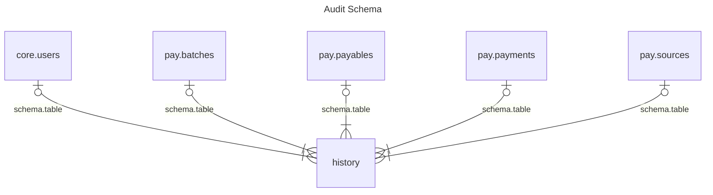
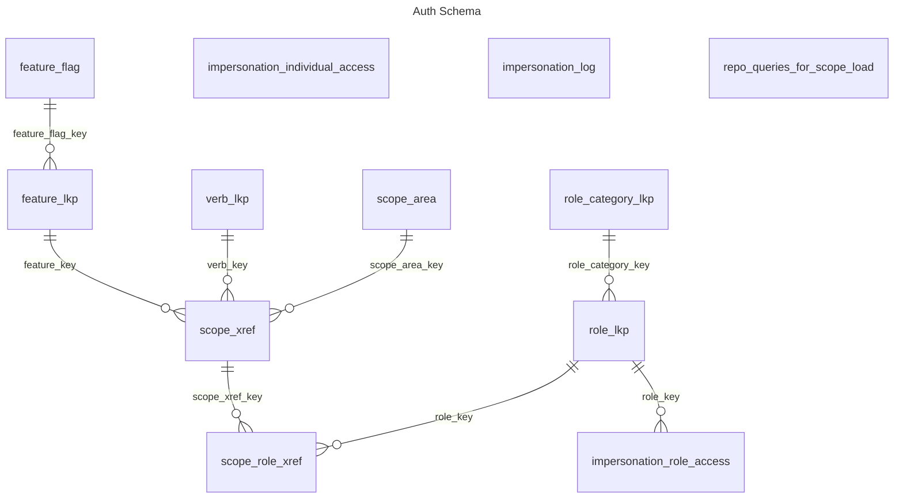
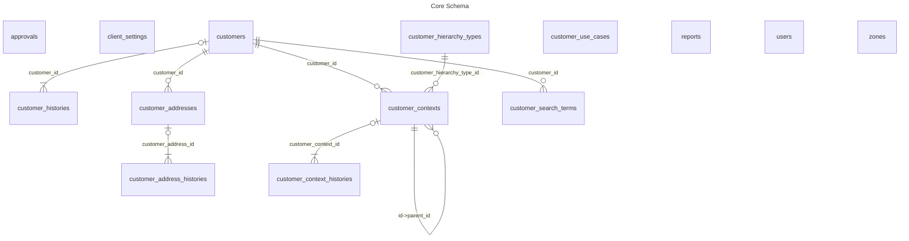
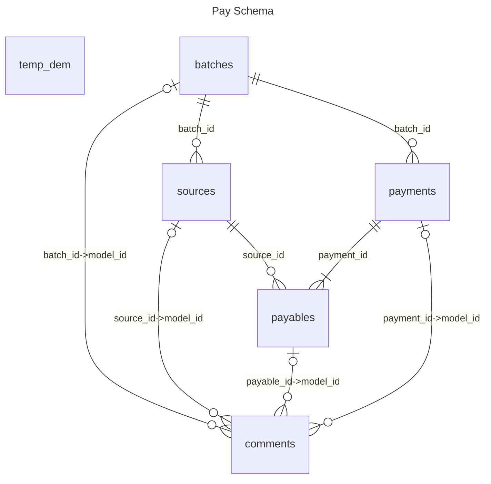

# pgmgmt-core-db documentation

## schemas

| name | description |
| ---- | ----------- |
| audit | change tracking |
| auth | users and roles |
| core | common tables |
| earn | earnings module |
| pay | pay module |

# Entity Relationship Diagrams

## audit

## auth

## core

## earn

## pay

